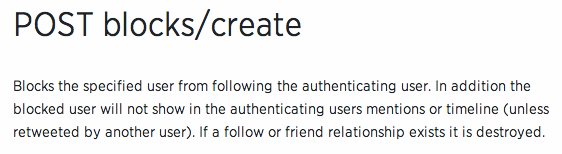
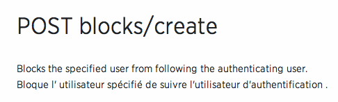
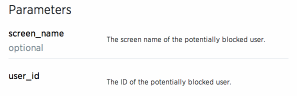
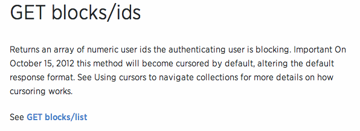
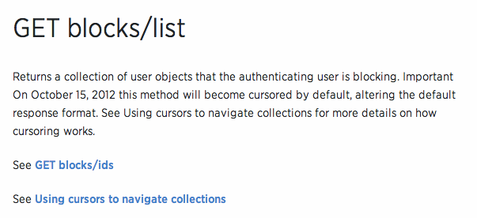

= Tribestream Twitter API Example
Jonathan Gallimore
v0.1, 2014-11-06 12pm
:title-logo: images/tomitribe_logo.png
// Settings:
:compat-mode:
:experimental:
:icons: font
:listing-caption: Listing
:sectnums:
:toc:
:toclevels: 3
ifdef::backend-pdf[]
:pagenums:
:pygments-style: bw
:source-highlighter: pygments
endif::[]

[abstract]

== Introduction

== Tribestream documentation annotations

== WADLx

== Documentation Annotations

Tribestream provides a number of annotations that a service developer can add to
the classes and methods in their application to describe its functionality, the 
type of output it provides, and more information about the parameters the service
makes availble to clients.

At runtime, Tribestream will use these annotations to generate beautiful documentation
for your application.

Here are all the annotations available:

=== @ApiVersion

APIs may introduce new methods or deprecate old ones as new versions are released.
Service developers can use the @ApiVersion annotation to indicate which versions
of the API the method is available in. API versions are specified as a String 
array on the annotation.

----
    @GET 
    @Produces("application/json")
    @Path("/configuration")
    @ApiVersion({"1.1"})
    @Description("Returns the current configuration used by Twitter including twitter.com slugs which are not usernames, maximum photo resolutions, and t.co URL lengths.")
    public Response getConfiguration() {
        //TODO: implementation
    }
----

=== @Category

Specifies the categories that the resource appears in. A resource may belong to
more than one category, by specifying all the categories the resource belongs to
in the value attribute of the annotation. For example, a resource annotated with
{@code @Category({ "account", "user" }}, will appear in both the account and user
categories.

----
    @GET
    @Produces("application/json")
    @Path("/settings")
    @Category({"account"})
    public Response getSettings() {
        //TODO: implementation
        
    }
----

=== @Description

The @Description allows you to provide a free-form textual description of what the
resource actually does. This text is rendered as supplied in the documentation.

For example, a method with the following annotations:

----
    @POST
    @Produces("application/json")
    @Path("/create")
    @Description("Blocks the specified user from following the authenticating 
    	user. In addition the blocked user will not show in the authenticating 
    	users mentions or timeline (unless retweeted by another user). If a 
    	follow or friend relationship exists it is destroyed.")
    public Response postCreate(/* parameters here */) {
    	// TODO: implement this method
    
    }
----

will render render using the text on the @Description annotation as shown below:

=== @Descriptions

The @Descriptions annotation allows you to provide a number of @Description 
annotations with different values for a resource. For example, you may wish to 
provide different descriptions for different languages.

----
    @POST
    @Produces("application/json")
    @Path("/create")
    @Descriptions({
            @Description(lang = "en", value = "Blocks the specified user from following the authenticating user."),
            @Description(lang = "fr", value = "Bloque l' utilisateur spécifié de suivre l'utilisateur d'authentification .")
    })
    public Response postCreate(/* parameters here */) {
    	// TODO: implement this method
    
    }
----

The text from each of the @Description annotations will be show in the documentation,
in the order that the @Description annotations are specified on @Descriptions.

                                                          
=== @Required

@Required is specified on a parameter of a service to mark it as mandatory.

In the example below, the user_id parameter is mandatory, while screen_name is
optional. 

----
    @POST
    @Produces("application/json")
    @Path("/create")
    public Response postCreate(@Description("The screen name of the potentially blocked user.")
                               @QueryParam("screen_name") final String screen_name, @Description("The ID of the potentially blocked user.")
                               @QueryParam("user_id") @Required final Integer user_id) {
        //TODO: implement
        return null;
    }
----

Optional paramaters are highlighted in the documentation.

=== @See

The @See annotation is much like the @see Javadoc annotation. It provideds a link
to other documentation or resources that may be relevant to the resource.

Each @See annotation requires a href (the destination of the link) and value
(the text that will displayed for the link).

----
    @GET
    @Produces("application/json")
    @Path("/ids")
    @See(href = "/docs/api/1.1/get/blocks/list", value = "GET blocks/list")
    public Response getIds(/* parameters here */) {
        //TODO: implement
        return null;
    }
----

=== @SeeAlso

Similar to the @Descriptions annotation, @SeeAlso allow multiples links to other
documentation or resources to be added to a resource. Each @See link shown in the
documentation in the order they are specified on the @SeeAlso annotation.

----
    @GET
    @Produces("application/json")
    @Path("/list")
    @SeeAlso({
    	@See(href = "/docs/api/1.1/get/blocks/ids", value = "GET blocks/ids"), 
    	@See(href = "/docs/misc/cursoring", value = "Using cursors to navigate collections")
    })
    public Response getList(/* parameters here */) {
        //TODO: implement
        return null;
    }
----

=== @Status

Indicates the current status of the resource. For example, if the signature of
this resource has not yet been finalized, the developer of the resource may wish
to indicate the resource as being in the draft status so the consumer of the API
is aware it may change.

Available statuses are:

[cols="2*", options="header"] 
|===
| Status| Description

|PROPOSAL
|A proposed service. May disappear or changed in the future.

|STUB
|A dummy implementation of the service. This may be provided for testing purposes.

|DRAFT
|A non-final version of the service. The definition may change in the future.

|TEST
|The service is available for testing purposes, and may not return live data.

|VALIDATION
|The service has been made available for validation purposes.

|ACCEPTED
|The service is stable and availble for consumption. 

|CONFIDENTIAL
|Not for public consumption, and should not be shared with other parties.
|===

=== @Tag

The @Tag annotation allows the developer to provide searchable keywords for the service.
Keywords are specified as a String array on the annotation.

----
    @GET
    @Produces("application/json")
    @Path("/lookup")
    @Tag({"Bulk Operations", "finding users"})
    @Description("Returns fully-hydrated user objects for up to 100 users per request, as specified by comma-separated values passed to the user_id and/or screen_name parameters.")
    public UsersType getLookup(/* parameters here */) {
        //TODO: implementation
    }
----

== Governance Annotations

=== @ApplicationLimit

=== @Concurrent

=== @GovernanceUnit

=== @Rate

=== @UserLimit
